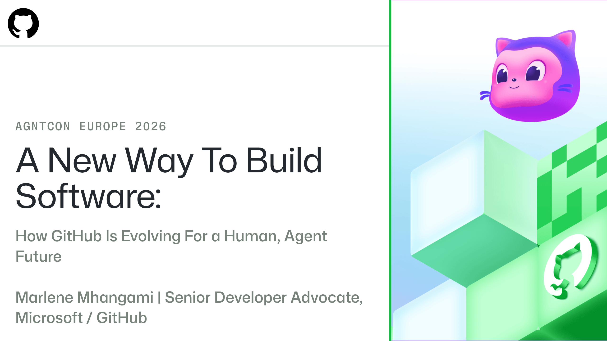

# A New Way To Build Software
### How GitHub Is Evolving For a Human, Agent Future

Keynote — **AGNTCon + MCPCon Europe 2026**, Amsterdam · Marlene Mhangami

## Abstract

Agents now write more code, faster — moving the bottleneck from *writing* to *reviewing and understanding*, and landing hardest on maintainers. This 10-minute keynote looks at how the modern GitHub experience is evolving for a world where humans and agents build together: richer issues and pull requests, stacked PRs, AI overviews and findings, and real controls that keep open source healthy.

## Slides

- **[▶ Click-through deck](https://marlenezw.github.io/agntcon-mcpcon-europe-2026/)**
- [PDF](./AGNTCon-Europe-2026-Keynote.pdf) · [PowerPoint](./AGNTCon-Europe-2026-Keynote.pptx)
